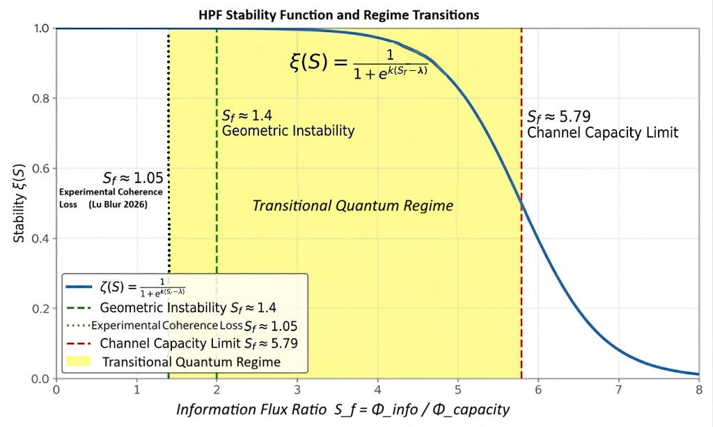

# Holographic Projection Framework (HPF)

## Canonical Research Release — March 20, 2026

HPF is a **regulatory execution framework** for bounded physical evolution on a finite-capacity substrate. In operating language, **HPF is the physics OS**.

This release consolidates the current canonical package state after the March 19–20 architecture lock, reversible-registry repair, continuation-ambiguity update, bridge recalibration, and theorem-safe existence-sensor pass.

---

## What HPF is

The Holographic Projection Framework (HPF) is not an object-level gravity theory. It is a layered framework that:

- enforces hard execution constraints,
- tracks bounded substrate load,
- distinguishes **legality** from **validity**,
- governs expert routing and lawful handoff,
- determines when effective theories remain trustworthy,
- routes execution to deeper substrate-side authority when effective descriptions cease to be valid or legal.

The canonical layer order is fixed:

1. **HPF** = regulator / legality framework  
2. **MDEA** = routing kernel  
3. **geometry / gravity** = downstream effective expert regime  
4. **QPRCA** = deeper substrate expert / handoff destination  

This order must not be inverted.

---

## Current package status

This release represents the current **canonical research/dev state** of HPF.

The framework now contains:

- a locked **legality / validity split**,
- a locked **two-wall architecture**,
- a candidate-locked closure-strain quartet,
- a locked routing score / picker architecture,
- an architecturally derived $M_{\rm route}$,
- a repaired reversible executable registry,
- a live continuation-ambiguity microscopic burden channel,
- a legality-tail-sensitive bridge recalibration recovering the four-regime derived-$\zeta$ corridor,
- a theorem-safe v0.2.8 **existence-sensor** protocol and finite-family test pass.

This is a serious, coherent release.

It is **not** a claim that strongest-form microscopic legality closure or first-principles geometry-validity closure are finished.

---

## Key conceptual structure

### 1. Legality is not validity

HPF treats these as distinct.

- A state/evolution is **legal** if it satisfies substrate-side constraints such as bounded load, finite resolution, locality, reversibility, and closure of the relevant update structure.
- A theory/expert is **valid** only if it remains trustworthy as an effective description inside a still-legal region.

That means geometry can fail before substrate illegality appears.

### 2. Two-wall architecture

HPF keeps two walls distinct:

- **Upper wall:** exact substrate hard wall  
$$
  \Lambda_c^{(\mathrm{sub})}=1
$$
- **Lower wall:** geometry-validity wall  
$$
  \Lambda_c^{(\mathrm{geom})}<1
$$
Canonical meaning:

- geometry may become invalid while substrate legality still survives,
- this can happen only in a bounded pre-illegality band,
- full substrate illegality remains a separate upper-wall event.

### 3. HPF is sovereign; geometry is downstream

Geometry/gravity is a bounded effective regime, not the regulator. When validity margin is lost, HPF must route away from geometry before literal substrate saturation.

---

## Included release components

### Canonical presentation volumes

- **Volume I** — `volume-1-master-canon.md`
  Top-level canon and first file to hand a reader.

- **Volume II** — `volume-2-microscopic-derivation.md`
  Microscopic derivation line, executable development spine, grouped-$L_2$ legality branch, theorem-work chain, and current executable context.

- **Volume III** — `volume-3-provenance-map.md`
  Supersession map, provenance, live-reference guide, and anti-drift navigation layer.

### Live executable line

- **Front active executable** — `qprca-v0.2.8.py`

### Existence-sensor protocol and test artifacts

- `existence-sensor-protocol-note.md`
- `existence-sensor-report.json`
- `sigma-pressure-test.json`

---

## Executable line summary

The current live executable family is the **v0.2.x** line.

### Historical milestones

- **v0.1** — first executable legality harness  
- **v0.1.1** — variable predecessor algebra  
- **v0.1.2** — normalized predecessor stable historical baseline  
- **v0.1.3** — richer non-predecessor exploratory branch  

### Enriched-canon progression

- **v0.2.0** — first enriched-canon executable reference  
- **v0.2.1** — first explicit derived-$\zeta$ recovery line  
- **v0.2.2** — grouped-$L_2$ promotion branch  
- **v0.2.3** — tuned grouped-$L_2$ projection branch  
- **v0.2.4** — floor-fixed grouped-$L_2$ projection branch  
- **v0.2.5** — reversible-registry repair branch  
- **v0.2.6** — continuation-ambiguity executable patch  
- **v0.2.7** — bridged continuation-ambiguity line with legality-tail-sensitive bridge recalibration  
- **v0.2.7** — bridged continuation-ambiguity line with legality-tail-sensitive bridge recalibration
- **v0.2.8** — existence-sensor integration; current front executable

Current recommendation:

- **Use v0.2.8 (`qprca-v0.2.8.py`) as the front executable.**

---

## Current theorem-track result

The v0.2.8 existence-sensor protocol asks a narrow executable question:

> On the sanitized reversible subregistry, does $F_{\min}(\psi_{\rm in}) < 1$ track the existence of at least one actually available legal reversible continuation?

This is explicitly **not** a universal sufficiency theorem.

It is a finite-family executable test on the current reversible subregistry.

Current reported confusion matrix:

- **True positive:** 204  
- **True negative:** 52  
- **False positive:** 0  
- **False negative:** 0  

Interpretation:

- the current existence-sensor run is a **strong pass on the tested family**,
- false positives were the critical failure mode to avoid,
- this supports the Selection-Lemma program at the current finite reversible level,
- it does **not** prove strongest-form operator richness or universal microscopic legality sufficiency.

---

## Truth-status discipline

This package is intentionally truth-status controlled.

The working status ladder is:

- **Fundamental**
- **Effective**
- **Derived**
- **Empirical / simulation-based**
- **Candidate-locked**
- **Open**

Interpretive rule:

- candidate-locked architecture must not be inflated into strongest-form closure,
- older wording must not override later March 19–20 closure status,
- legality and validity must not be collapsed,
- geometry must not be promoted to regulator,
- QPRCA must not be promoted to regulator.

---

## What remains open

This release is strong, but it is not final closure.

Major open fronts still include:

- strongest-form microscopic legality closure,
- strongest-form operator richness,
- first-principles lower-wall / geometry-validity constitutive derivation,
- broader trajectory validation beyond the current finite tested family,
- continued sharpening of the microscopic burden laws,
- future external empirical discrimination.

That is the correct current status.

---

## Recommended reading order

1. **Volume I** — top-level canon
2. **Volume II** — microscopic derivation, executable spine, theorem work
3. **Volume III** — supersession and provenance map
4. **`qprca-v0.2.8.py`** — front live executable
5. **Existence-sensor protocol + reports** — theorem-safe diagnostic layer

---

## Repository posture

This repository should be read as a **canonical active research release**, not as a final closed theory.

Best concise description:

> HPF/MDEA is a layered, truth-status-controlled regulatory execution framework with a locked legality/validity split, a locked two-wall architecture, a repaired reversible executable line, and an active theorem/reproduction track.

---

## Citation / usage note

If you discuss or reference this release, use the March 20, 2026 canonical package state rather than older partial drafts. Volume III records what is current, what is supporting, and what has been superseded.
